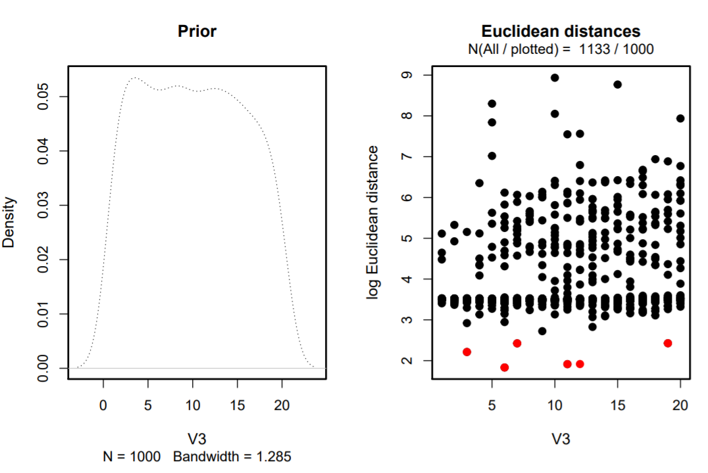
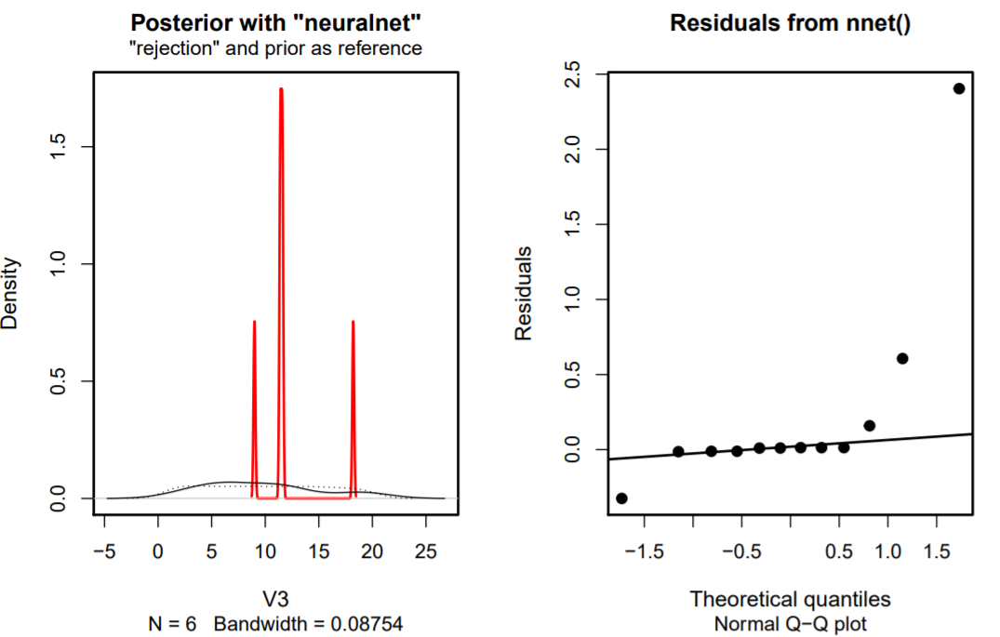

<style type="text/css">

body{ /* Normal  */
      font-size: 12px;
  }
td {  /* Table  */
  font-size: 8px;
}
h1.title {
  font-size: 38px;
  color: DarkRed;
}
h1 { /* Header 1 */
  font-size: 14px;
  color: Black;
}
h2 { /* Header 2 */
    font-size: 12px;
  color: Black;
}
h3 { /* Header 3 */
  font-size: 12px;
  font-family: "Times New Roman", Times, serif;
  color: Black;
}
code.r{ /* Code block */
    font-size: 12px;
}
pre { /* Code block - determines code spacing between lines */
    font-size: 14px;
}
</style>

**Data preparation**

**Dataset - German Housing Data**

Origin data set cleaned:

Variable rooms, bathrooms, bedrooms, floors, garages, Year_built, Year_renovated changed from decimal to integer
Subset with buildings up to 20 rooms for our analysis created
Rooms with .5 rounded up
Levels of the variable Energy_source and Garagetype transformed.

**Load of the cleaned dataset**

```{r}
data <- read.csv('german_housing_cleaned.csv',header =T, encoding='UTF-8')
head(data)
```

**Inspection of all variables**
```{r, eval=FALSE}
str(data)
summary(data)
colnames(data)
```

**Analysis of the distribution of the variables: 'Price', 'Living_space', 'Rooms' and 'Lot'**
```{r}
par(mfrow = c(2,2))

#Price
plot(density(data$Price))

#Living_space
plot(density(data$Living_space))

#Rooms
hist(data$Rooms)

#Lot
plot(density(data$Lot))


```

Result: The variables are right skewed


**Log Transformation of variables**

Therefore we will use the Log Transformation of the variables 'Price', 'Living_space', 'Rooms', 'Lot' to get a nearly normal distribution
``` {r}
par(mfrow = c(2,2))

#Price
price.log <- density(log(data$Price))
plot(price.log)

#Living_space
living.log <- density(log(data$Living_space))
plot(living.log)

#Rooms
rooms.log <- log(data$Rooms)
hist(rooms.log)

#Lot
lot.log <- density(log(data$Lot))
plot(lot.log)
```

**Add new columns with log transformed variables price, living space and rooms**
```{r}
data1 <- data
data1$log.price <- log(data1$Price)
data1$log.living <- log(data1$Living_space)
data1$log.rooms <- log(data1$Rooms)
data1$log.lot <- log(data1$Lot)
```

# Week 1 - Linear Models

## Data Visualisation and Linear regressions

The variables Price, Living_space and Rooms are checked for na values
```{r, message=F, error=F, warning=F}
options(scipen=999) #block scientific notation
library(ggplot2)
attach(data)
any(is.na(Price))
any(is.na(Living_space))
any(is.na(Rooms))
```


## Scatterplot with regression line for log(Price) against log(Living_space)
We plot the response variable "Price" against the predictor "Living_Space" to get a first impression and grahical analysis.
```{r, message=F}
#Living_space
ggplot(data, aes(log(Living_space), log(Price))) + geom_point() + geom_smooth(method = lm, se = T, color = 'red') + ggtitle('Scatterplot with regression line for log(Price) against log(Living_space)')
```

## Fitting a Simple Linear regression of log(Price) against log(Living_space) and check the coefficients
```{r}
#linear model
lm.log.price_living <- lm(log(Price) ~ log(Living_space))
summary(lm.log.price_living)

#estimated regression coefficients
living.coefs <- coef(lm.log.price_living)
living.coefs

#p-values
summary(lm.log.price_living)$coefficients

```

Result: very significant p-values for Price ~ Living_space. We can assume that the variable Living_space has an effect on the dependent variable (Price) with a positive correlation, meaning: if the Living_space parameter increase in value also the Price of the property will increase. 

We interpret the intercept and the second coefficient, the slope, we exponentiate the values. The results are: For the intercept exp(8.17522)= 3551.84 and the slope exp(0.9028)=2.47

Interpretation: It seems to be a positive relationship between these two variables. More livingspace seems to have a higher price. So we fit a simple regression model to the data. With a livingspace of 0 the price would be 3551.84 EURO and with each unit increase of the livingspace the price increase by 2.47 EURO which does not make much sense. The p-value is very small therefore we have a strong evidence that the slope for livingspace is not flat.

### Measures of fit
```{r}
#r.squared
summary(lm.log.price_living)$r.squared
```

```{r}
#adj.r.squared
summary(lm.log.price_living)$adj.r.squared
```

Note: There is no threshold to define a model fit to be good, however a model that explain all the variability of the data would have an R^2 of 1.


## Linear regression of log(Price) against log(Living_space) including the Type and finding the intercept for the different Types.
```{r}
##linear model
lm.log.price_living_type <- lm(log(Price) ~ log(Living_space) + Type)
summary(lm.log.price_living_type)

#estimated regression coefficients
living_type.coefs <- coef(lm.log.price_living_type)
living_type.coefs

#intercept of Type "NULL"
notype.coefs <- coef(lm.log.price_living_type)['(Intercept)']
notype.coefs

#intercept of Type single dwelling
sgl.dwelling.coefs <- coef(lm.log.price_living_type)['(Intercept)'] + coef(lm.log.price_living_type)['TypeSingle dwelling']
sgl.dwelling.coefs

#p-values
summary(lm.log.price_living_type)$coefficients
```

Result: mostly very significant p-values for Price ~ Living_space and different types. Only TypeCastle and TypeDuplex with non significant values. We can assume that the different types have different impact on the variable Price against Living_space. 

Interpretation of the coefficients of Type variable: 
Intercept for TypeSingle Dwelling: exp(7.869463) with Slope: exp(0.9969080)

### Measures of fit
```{r}
#r.squared
summary(lm.log.price_living_type)$r.squared

#adj.r.squared
summary(lm.log.price_living_type)$adj.r.squared
```


## Linear regression of log(Price) against log(Rooms)
In an next step we examine the data set graphically and consider again "Price" as response variable but as predictor "Rooms" and we fit the model again with a simple linear regression.
```{r,message=F}
#Rooms
ggplot(data, aes(Rooms,Price)) + geom_point()+ geom_smooth(method = lm, se = F, color= 'red') +
scale_x_continuous(breaks = rep(1:20,len=20)) + ggtitle('Plot of Price against Rooms with regression line in red')

lm.log.price_rooms <- lm(log(Price) ~ log(Rooms))
summary(lm.log.price_rooms)
```

### Measures of fit
```{r}
#r.squared
summary(lm.log.price_rooms)$r.squared

#adj.r.squared
summary(lm.log.price_rooms)$adj.r.squared
```

## Linear regression of log(Price) against Type
Now we are modelling a linear regression with dependent variable 'Price' and the categorical variable "Type" as independent variable. First we visualize the variable 'Type' with a boxplot with and one without outliers.
```{r}
types.box.with_outlier <- ggplot(data, aes(x=Type, y=log(Price))) + geom_boxplot(outlier.colour = 'red')+ theme(axis.text.x = element_text(angle = 90)) + ggtitle('Boxplots of log(Price) against Types with outliers in red')
plot(types.box.with_outlier)

types.box.no_outlier <- ggplot(data, aes(x=Type, y=log(Price))) + geom_boxplot(outlier.shape = NA)+ theme(axis.text.x = element_text(angle = 90)) + ggtitle('Boxplots of log(Price) against Types without outliers')
plot(types.box.no_outlier)

lm.log.price_type <- lm(log(Price) ~ Type)
summary(lm.log.price_type)
```


## Testing the effect of a categorical variable and post-hoc contrasts 
```{r, warning=F, message=F}
head(data1)

condition.box.with_outlier <- ggplot(data1, aes(x=Condition, y=log.price)) + geom_boxplot(outlier.colour = 'red')+ theme(axis.text.x = element_text(angle = 90)) + ggtitle('Boxplots of log(Price) against Condition with outliers in red')
plot(condition.box.with_outlier)

#model
lm.price_condition.1 <- lm(log.price ~ Condition, data = data1)
summary(lm.price_condition.1)

#coefficients
condition.coef.1 <- coef(lm.price_condition.1)
condition.coef.1

#model without slope, only intercept
lm.price_condition.0 <- lm(log.price ~ 1, data = data1)
summary(lm.price_condition.0)
condition.coef.0 <- coef(lm.price_condition.0)
condition.coef.0

#Anova
anova.condition <- anova(lm.price_condition.0, lm.price_condition.1)
anova.condition

#post-hoc contrasts
library(multcomp)
unique(data1$Condition)
ph.test.1 <- glht(model = lm.price_condition.1, linfct = mcp(Condition = c('refurbished - dilapidated = 0')))
summary(ph.test.1)
```

## Testing categorical variable (Furnishing_quality)and comparing by F-test 
```{r}
furnish.box.with_outlier <- ggplot(data, aes(x=Furnishing_quality, y=log(Price))) + geom_boxplot(outlier.colour = 'red')+ theme(axis.text.x = element_text(angle = 90)) + ggtitle('Boxplots of log(Price) against Furnishing Quality with outliers in red')
plot(furnish.box.with_outlier)

furnish.box.no_outlier <- ggplot(data, aes(x=Furnishing_quality, y=log(Price))) + geom_boxplot(outlier.shape = NA)+ theme(axis.text.x = element_text(angle = 90)) + ggtitle('Boxplots of log(Price) against Furnishing Quality without outliers')
plot(furnish.box.no_outlier)

lm.furnishing <- lm(log(Price) ~ Furnishing_quality)
summary(lm.furnishing)

lm.furnishing1 <- lm(log(Price) ~ 1)
summary(lm.furnishing1)

anova.furnishing <- anova(lm.furnishing1, lm.furnishing)
summary(anova.furnishing)
```


### Adding more categorical variables to the testing above
```{r}
lm.furnishing2 <- update(lm.furnishing,. ~ . + Type + Condition)
formula(lm.furnishing2)
drop1(lm.furnishing2, test = "F")
```

## Linear regression of log(Price) against log(Living_space) including the Type-Living_space interaction 
```{r}
lm.interact <- lm(log(Price) ~ log(Living_space) * Type) # lm(y ~ x1 * x2) equivalent to lm(y ~ x1 + x2 + x1:x2)
summary(lm.interact)

#coefficients
interact.coefs <- coef(lm.interact)
interact.coefs

#p-values
summary(lm.interact)$coefficients

#Confidence Intervals
lm.interact.CI <- confint(lm.interact)
lm.interact.CI
```

### Measures of fit
```{r}
#r.squared
summary(lm.interact)$r.squared

#adj.r.squared
summary(lm.interact)$adj.r.squared
```


## Fitted values

**The function fitted() can be used to extract the predicted values for the existing observations**
```{r}
attach(data)
#lm.log.price_living
fitted.price_living <- fitted(lm.log.price_living)
str(fitted.price_living)
head(fitted.price_living)
plot(log(Price)~ log(Living_space), main = 'Model log(Price) ~ log(Living_space)', col = 'navy', pch = 16)
points(fitted.price_living ~ log(Living_space), col = 'red', pch = 16)
abline(lm.log.price_living, col = 'yellow', lwd = 2.5)


#lm.log.price_rooms
fitted.price_rooms <- fitted(lm.log.price_rooms)
str(fitted.price_rooms)
head(fitted.price_rooms)
plot(log(Price)~ log(Rooms), main = 'Model log(Price) ~ log(Rooms)', col = 'navy', pch = 16)
points(fitted.price_rooms ~ log(Rooms), col = 'red', pch = 16)
abline(lm.log.price_rooms, col = 'yellow', lwd = 2.5)
```


## Residuals of model log(Price) ~ log(Living_space)
```{r, message = F}
attach(data1)
resid.price_living <- resid(lm.log.price_living)
length(resid.price_living)
head(resid.price_living)

set.seed(100)
id <- sample(x = 1:10318, size = 5)
resid.price_living[id]
fitted.price_living[id]

plot(log(Price) ~ log(Living_space), main = 'Modellog(Price) ~ log(Living_space)', col = 'navy', pch = 16)
abline(lm.log.price_living, col = 'green', lwd = 2.5)

points(log(Price) ~ log(Living_space), data = data1[id, ], col = 'red', pch = 4, lwd = 5)
segments(x0 = data1[id, 'log.living'], x1 = data1[id, 'log.living'],
         y0 = fitted.price_living[id], y1 = data1[id, 'log.price'], col = 'yellow', lwd = 2)
```


## Residuals of model log(Price) ~ log(Rooms)
```{r, message = F}
attach(data1)
resid.price_rooms <- resid(lm.log.price_rooms)
length(resid.price_rooms)
head(resid.price_rooms)

set.seed(100)
id <- sample(x = 1:10318, size = 5)
resid.price_rooms[id]
fitted.price_rooms[id]

plot(log(Price) ~ log(Rooms), main = 'Modellog(Price) ~ log(Rooms)', col = 'navy', pch = 16)
abline(lm.log.price_rooms, col = 'green', lwd = 2.5)

points(log(Price) ~ log(Rooms), data = data1[id, ], col = 'red', pch = 4, lwd = 5)
segments(x0 = data1[id, 'log.rooms'], x1 = data1[id, 'log.rooms'],
         y0 = fitted.price_rooms[id], y1 = data1[id, 'log.price'], col = 'yellow', lwd = 3)
```


## Predicting values using splitted data set 80:20 ratio
```{r, message = F}
#split dataset 
split80 <- round(nrow(data1)* 0.80)
train <- data1[1:split80,]
test <- data1[(split80 + 1):nrow(data1),]
dim(train)
dim(test)

#linear regression model
lm.train <- lm(log.price ~ log.living, data = train)
summary(lm.train)

#predictions
pred.new.living <- predict(object = lm.train, newdata = test)
pred.new.living.CI <- predict(object = lm.train, interval = 'prediction', newdata = test)

#display predictions
plot(log.price ~log.living, data = data1, main = 'Prediction with Model log(Price) ~ log(Living_space)', col = 'navy', pch = 16)
points(x = test$log.living, y= pred.new.living, col = 'red', pch = 16, cex = 1.5)
abline(lm.train, col = 'yellow', lwd = 2.5)


plot(log.price ~ log.living, data = train, main = 'Prediction with Model log(Price) ~ log(Living_space)', col = 'navy', pch = 16)
segments(x0 = test$log.living, x1 = test$log.living,
         y0 = pred.new.living.CI[, 'lwr'], y1 = pred.new.living.CI[, 'upr'], lwd = 2, col = 'green')
points(x = test$log.living, y= pred.new.living.CI[,'fit'], col = 'red', pch = 16, cex =1.5)
abline(lm.train, col = 'yellow', lwd = 2.5)
```


# Week 2 - Non-linearity

## Polynomials
By including polynomials (e.g. x1 + x1^2) we can model non linear relationships with a Linear Model.

```{r, message = F, error = F, warning=F}
library(ggplot2)
attach(data1)
``` 

**Graphical analysis** 

log(Price) ~ Rooms (not log transformed)
```{r, message = F}
#log(Price) ~ Rooms
gg.log.price_rooms <- ggplot(data1, mapping = aes(y = log(Price),x = Rooms)) + geom_point()
gg.log.price_rooms + geom_smooth() + scale_x_continuous(breaks = rep(1:20,len=20))
```


log(Prices) ~ log(Rooms) with log transformation
```{r, message = F}
#log(Price) ~ log(Rooms)
gg.log.price_log.rooms <- ggplot(data1, mapping = aes(y = log.price, x = log.rooms)) + geom_point()
gg.log.price_log.rooms + geom_smooth() 
```


log(Price) ~ log(Living_space)
```{r}
gg.log.price_log.living <- ggplot(data1,mapping = aes(y = log.price, x = log.living)) + geom_point()
gg.log.price_log.living + geom_smooth()
```

Quadratic Effects
```{r}
#model with a linear effect for log.living
lm.living.1 <- lm(log.price ~ log.living + log.rooms)
summary(lm.living.1)
```

```{r}
#model with a quadratic effect for log.living
lm.living.2 <- update(lm.living.1, . ~ . + I(log.living^2))
summary(lm.living.2)
```

```{r}
#test in quadratic
anova.lm.living <- anova(lm.living.1, lm.living.2)
summary(anova.lm.living)
```

```{r}
#plot
gg.log.price_log.living + geom_smooth(method = 'lm', formula = y ~poly(x, degree = 2))
``` 

```{r}
#model with a quadratic poly
lm.living.3 <- lm(log.price ~ log.rooms + log.living + poly(log.living, degree = 2))
summary(lm.living.3)
```

```{r}
#model with a cubic poly
lm.living.4 <- lm(log.price ~ log.rooms + log.living + poly(log.living, degree = 3))
summary(lm.living.4)
```

```{r, message = F, warning=F}
gg.log.lot.log.price <- ggplot(data = data1, mapping = aes(y = log.lot, x = log.price)) + geom_point()
gg.log.lot.log.price + geom_smooth(method = 'gam')
```

## Regression Splines
```{r}
library(splines)
lm.regression_splines <- lm(log.price ~ bs(log.living, df = 3))
summary(lm.regression_splines)
```


## Generalised Additive Models - GAMs
```{r}
library(mgcv)
``` 

GAMs for log(Price) ~ s(Rooms)
```{r}
attach(data1)
gam.log.price.rooms <- gam(log.price ~ s(Rooms))
summary(gam.log.price.rooms)
plot(gam.log.price.rooms, residuals = TRUE, cex = 2)
```

GAMs for log(Price) ~ log(Rooms)
```{r}
gam.log.price.log.rooms <- gam(log.price ~ s(log.rooms))
summary(gam.log.price.log.rooms)

plot(gam.log.price.log.rooms, residuals = TRUE, cex = 2)
```

GAMs for log(Price) ~ log(Living_space) + s(Rooms) + s(Garages)
```{r}
gam.log.price.log.living <- gam(log.price ~ log.living + s(Rooms) + s(Garages))
summary(gam.log.price.log.living)

plot(gam.log.price.log.living, residuals = TRUE, select = 1)
```


# Week 3 - Generalised Linear Models

## GLM - Possion Model

**Count Data**

With the GLM function and the family "possion" we could generalize the Linear model that the right-skewed data Rooms and Type can be followed without log- transformation in the first place.
```{r}

#str(data)
glm.rooms <- glm(Rooms ~ Type,
family = "poisson",
data = data)

summary(glm.rooms)

```

```{r}
#Interpretation the coefficients of a Poisson model the inverse, the exponential, is needed due to use of the link function (log() function)
exp(coef(glm.rooms)) 

```

The Interpretation of the coefficients are: A house with no Type information has around 7.6 rooms and e.g. Villa has ca. 15.77% more rooms (ca. 8.8 rooms)

```{r, include = T}
#to double check and convince ourselves as single house (type) is checked and predicted

library(tidyverse)

#which(data$Type == "")

#data[99,]
fitted.room <- fitted(glm.rooms)[99]
fitted.room

specific.room <- data[99,]
specific.room$Type <- "Villa"
#specific.room

pred.specific.room <- predict(glm.rooms,
                           type = "response",
                           newdata = specific.room)
pred.specific.room

fitted.room * exp(coef(glm.rooms)["TypeVilla"])

```
This house with no specific Type, according to the model, is expected to have 7.607 Rooms. If we check the number of rooms after setting the Type to e.g. Villa the model expect 8.807 rooms and this is exactly the same number of rooms we get for the fitted room times the exponential estimated for Villa


**data simulation from the glm count data model**
```{r}

#data simulation from the glm model (glm.rooms)
set.seed(99)
sim.data.rooms.Poisson <- simulate(glm.rooms)
##
NROW(sim.data.rooms.Poisson)

head(sim.data.rooms.Poisson)
tail(sim.data.rooms.Poisson)

```


**Visualization of the glm count data model**
``` {r}
ggplot(mapping = aes(y = sim.data.rooms.Poisson$sim_1,
x = data$Type)) +
geom_boxplot() +
geom_hline(yintercept = 0) +
ylab("simulated no. of rooms\n(assuming Poisson dist)") +
xlab("type") + theme(axis.text.x = element_text(angle = 90))
```
The results of the simulation seem to agree with those of the boxplot, see for example Type = Villa


**GLM with binomial data continious variable**

```{r}

df.glm <- data.frame(data$Price, data$Living_space, data$Year_built)

df.glm <-na.omit(df.glm)

any(is.na(df.glm))
str(df.glm)

glm.sq.price <- glm(cbind(data.Price, data.Living_space)~ data.Year_built,
                    family = "binomial",
                    data = df.glm)

summary(glm.sq.price)

exp(coef(glm.sq.price))

ggplot(data = df.glm,
       mapping = aes(y = data.Price/data.Living_space,
                     x = data.Year_built)) + 
  geom_point() +
  geom_smooth(method = "glm", 
              se = FALSE,
              method.args = list(family = "binomial"))

```
**GLM with binomial data factor variable**

```{r}

glm.sq.price <- glm(cbind(Price, Living_space)~ State,
                    family = "binomial",
                    data = data)

summary(glm.sq.price)

exp(coef(glm.sq.price))

ggplot(data = data,
       mapping = aes(y = Price/Living_space,
                     x = State)) + 
  geom_point() +
  geom_smooth(method = "glm", 
              se = FALSE,
              method.args = list(family = "binomial"))

```
If we compare the Residual deviance and the corresponding degrees of freedom in the summary output we would expect in an truly Poisson distributed data hat the residual dviance and the degrees of freedom would be approximately the same value. Therefore it could be overdispersed here and we use the "quasibinomial" family.

```{r}
glm.sq.price <- glm(cbind(Price, Living_space)~ State,
                    family = "quasibinomial",
                    data = data)

summary(glm.sq.price)

exp(coef(glm.sq.price))
```
The dispersion parameter ist now 109.92, This implies the variance increases faster than linearly. Anyway in this case there is no evidence that the State have an impact on the response variable.


``` {r, warning = F, message = F}
#install.packages('mltools')
library(mltools)

# Resulting bins have an equal number of observations in each group
data[, "wt2"] <- bin_data(data$Price, bins=4, binType = "quantile")

# Resulting bins are equally spaced from min to max
data[, "wt3"] <- bin_data(data$Price, bins=4, binType = "explicit")

# Or if you'd rather define the bins yourself
data[, "wt4"] <- bin_data(data$Price, bins=c(-Inf, 250, 322, Inf), binType = "explicit")
head(data)
```

``` {r}
glm.roomswt2 <- glm(Rooms ~ wt2,
family = "poisson",
data = data)

summary(glm.roomswt2)
```

``` {r}
set.seed(99)
sim.data.rooms.Poissonwt2 <- simulate(glm.roomswt2)
##
NROW(sim.data.rooms.Poissonwt2)

head(sim.data.rooms.Poissonwt2)
tail(sim.data.rooms.Poissonwt2)
```

``` {r}
library(ggplot2)
ggplot(mapping = aes(y = sim.data.rooms.Poissonwt2$sim_1,
x = data$wt2)) +
geom_boxplot() +
geom_hline(yintercept = 0) +
ylab("simulated no. of rooms\n(assuming Poisson dist)") +
xlab("Groups")
```
**GLM - Binary Model**

Let’s fit a binary model
``` {r, results = 'hide'}
data$MillionYes <- ifelse(data$Price > 1000000, 1, 0)
data$MillionYes

ggplot(data = data,
mapping = aes(y = MillionYes,
x = log(Living_space))) +
geom_point()
```
Let’s fit a logistic regression model and add fit to the this graph

``` {r}
glm.binary <- glm(MillionYes ~ Living_space,
                  family = "binomial",
                  data = data)

ggplot(data = glm.binary,
       mapping = aes(y = MillionYes,
                     x = Living_space)) + 
  geom_point() +
  geom_smooth(method = "glm", 
              se = FALSE,
              method.args = list(family = "binomial")) 
```


# Week 4 - Support Vector Machines
```{r}
data$wt5 <- factor(ifelse(data$Price > 600000, 1, -1))
data$wt5 = as.factor(data$wt5)
str(data)
```

``` {r}
# Load ggplot2
library(ggplot2)
# Plot x2 vs. x1, colored by y
scatter_plot<- ggplot(data = data, aes(x = Living_space, y = Year_built, color = wt2
                                       
                              )) + 
    # Add a point layer
    geom_point() + 
    scale_color_manual(values = c("red", "blue","green", "purple")) +
    # Specify equal coordinates
    coord_equal()
 
scatter_plot  
```

```{r}
x1 <- scales::rescale(data$Living_space, to=c(0,1))
x2 <- scales::rescale(data$Year_built, to=c(0,1))
x3 <- scales::rescale(data$Rooms, to=c(0,1))
x4 <- scales::rescale(data$Lot, to=c(0,1))
```

``` {r}
# Load ggplot2
library(ggplot2)
# Plot x2 vs. x1, colored by y
scatter_plot<- ggplot(data = data, aes(x = x1, y = x2, color = wt2
                                       
                              )) + 
    # Add a point layer
    geom_point() + 
    scale_color_manual(values = c("red", "blue","green", "purple")) +
    # Specify equal coordinates
    coord_equal()
 
scatter_plot  
```

``` {r}
# Load ggplot2
library(ggplot2)
# Plot x2 vs. x1, colored by y
scatter_plot<- ggplot(data = data, aes(x = x1, y = x2, color = wt5
                                       
                              )) + 
    # Add a point layer
    geom_point() + 
    scale_color_manual(values = c("red", "blue")) +
    # Specify equal coordinates
    coord_equal()
 
scatter_plot  
```

``` {r}
# Load ggplot2
library(ggplot2)
# Plot x2 vs. x1, colored by y
scatter_plot<- ggplot(data = data, aes(x = x1, y = x3, color = wt5
                                       
                              )) + 
    # Add a point layer
    geom_point() + 
    scale_color_manual(values = c("red", "blue")) +
    # Specify equal coordinates
    coord_equal()
 
scatter_plot  
```

``` {r}
# Load ggplot2
library(ggplot2)
# Plot x2 vs. x1, colored by y
scatter_plot<- ggplot(data = data, aes(x = x1, y = x4, color = wt5
                                       
                              )) + 
    # Add a point layer
    geom_point() + 
    scale_color_manual(values = c("red", "blue")) +
    # Specify equal coordinates
    coord_equal()
 
scatter_plot  
```

```{R}
testdf <- data.frame(x2,x1,data$wt5)
print(testdf)
```

```{r}
#install.packages("e1071")
library(e1071)
```

```{r}
# Print average accuracy and standard deviation
accuracy <- rep(NA, 1)
set.seed(2)
# Calculate accuracies for 100 training/test partitions
for (i in 1:1){
    testdf[, "train"] <- ifelse(runif(nrow(testdf)) < 0.8, 1, 0)
    trainset <- testdf[testdf$train == 1, ]
    testset <- testdf[testdf$train == 0, ]
    trainColNum <- grep("train", names(trainset))
    trainset <- trainset[, -trainColNum]
    testset <- testset[, -trainColNum]
    svm_model <- svm(data.wt5 ~ ., data = trainset, type = "C-classification", kernel = "linear")
    pred_test <- predict(svm_model, testset)
    accuracy[i] <- mean(pred_test == testset$data.wt5)
}
# Print average accuracy and standard deviation
mean(accuracy)
sd(accuracy)
```
```{r}
plot(svm_model,testset)
```


```{r}
# Print average accuracy and standard deviation
accuracy <- rep(NA, 10)
set.seed(2)
# Calculate accuracies for 100 training/test partitions
for (i in 1:10){
    testdf[, "train"] <- ifelse(runif(nrow(testdf)) < 0.8, 1, 0)
    trainset <- testdf[testdf$train == 1, ]
    testset <- testdf[testdf$train == 0, ]
    trainColNum <- grep("train", names(trainset))
    trainset <- trainset[, -trainColNum]
    testset <- testset[, -trainColNum]
    svm_model <- svm(data.wt5 ~ ., data = trainset, type = "C-classification", kernel = "radial")
    pred_test <- predict(svm_model, testset)
    accuracy[i] <- mean(pred_test == testset$data.wt5)
}

# Print average accuracy and standard deviation
mean(accuracy)
sd(accuracy)
```

```{r}
plot(svm_model,testset)
```


# Week 5 - Neural Networks

## ANN - neuralnet package

preparing data for neuralnet
```{r}
library(tidyverse)
library(data.table)
library(neuralnet)
library(caret)
```

```{r}
str(data)
apply(data,2,function(x) sum(is.na(x)))

df <- data.frame(data$Price, data$Living_space, data$Lot, data$Rooms, data$Year_built, data$Garages)

df.house <- na.omit(df)

#dummy <- dummyVars(" ~ .", data=df.house)
#df.house <- data.frame(predict(dummy, newdata = df.house)) 
any(is.na(df.house))
str(df.house)
mean(data$Price)
```

**Prepare for Training**
```{r}
set.seed(123)
indices <- createDataPartition(df.house$data.Price, p = 0.8, list = FALSE)
train <- df.house %>% slice(indices)
test <- df.house %>% slice(-indices)
boxplot(train$data.Price, test$data.Price, df.house %>% sample_frac(0.2) %>% pull(data.Price))
```


```{r}
max <- apply(df.house, 2, max)
min <- apply(df.house, 2, min)
df.house_scaled <- as.data.frame(scale(df.house, center = min, scale = max - min))
train_scaled <- df.house_scaled %>% slice(indices)
test_scaled <- df.house_scaled %>% slice(-indices)
```


### Fit the Network
```{r}
n <- names(train_scaled)

f <- as.formula(paste("data.Price ~", paste(n[!n %in% "data.Price"], collapse = " + ")))
nn <- neuralnet(f,data=train_scaled,hidden=c(5,3),linear.output=T)
plot(nn)

```

```{r}
pred_scaled <- compute(nn, test_scaled %>% select(-data.Price))

pred <- pred_scaled$net.result * (max(df.house$data.Price) - min(df.house$data.Price)) + min(df.house$data.Price)
#pred
```

```{r}
plot(test$data.Price, pred, col='blue', pch=16, ylab = "predicted Price NN", xlab = "real Price")
abline(0,1)
```
And calculate the RMSE
```{r}
sqrt(mean((test$data.Price - pred)^2))
```


## ANN - caret package
```{r message=FALSE, warning=FALSE, eval = F}

str(df.house)

set.seed(42)
tuGrid <- expand.grid(.layer1=c(1:4), .layer2=c(0,2), .layer3=c(0))

trCtrl <- trainControl(
  method = 'repeatedcv', 
  number = 5, 
  repeats = 10, 
  returnResamp = 'final'
)

models <- train(
  x = df.house %>% select(-data.Price),
  y = df.house_scaled %>% pull(data.Price),
  method = 'neuralnet', metric = 'RMSE', 
  linear.output = TRUE,
  #be careful, does only work on x!
  preProcess = c('center', 'scale'),
  tuneGrid = tuGrid,
  trControl = trCtrl
)
```

```{r, eval = FALSE}
plot(models)
```

```{r, eval = FALSE}
plot(models$finalModel)
```


# Week 6 - Agent-based Modelling and Approximate Bayesian Computation

## Result
```{r pressure, echo=FALSE, fig.cap="ABM_1", out.width = '100%'}

```

```{r pressure, echo=FALSE, fig.cap="ABM_2", out.width = '100%'}

```


