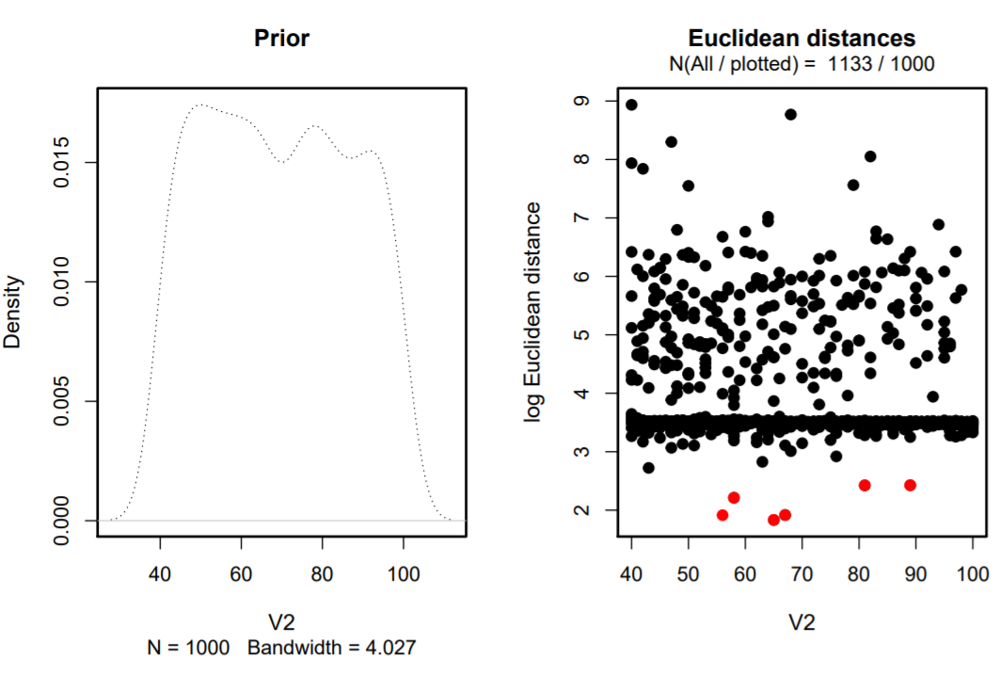
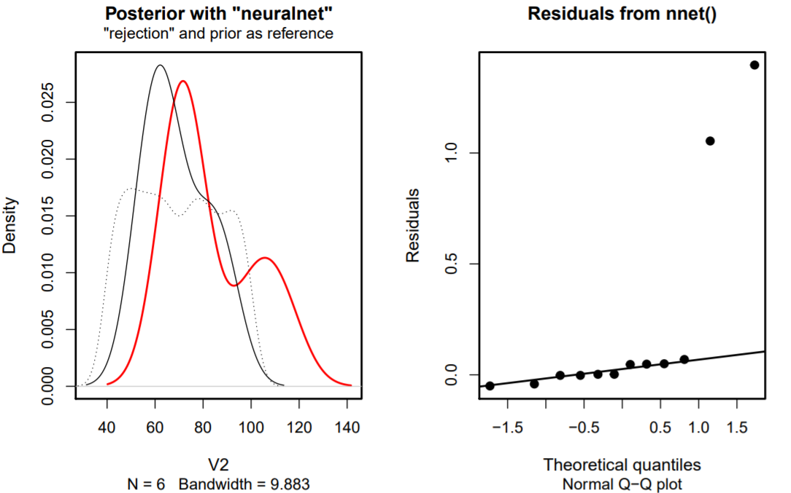

```{r setup, include=FALSE}
knitr::opts_chunk$set(echo = TRUE)
```
**Data preparation**
**Dataset - German Housing Data**
Dataset of housing prices in the german market, scraped from Immo Scout24 and made available on https://www.kaggle.com/scriptsultan/german-house-prices
The dataset contains 10'318 observations with 20 variables (containing continuous, categorical variables as well as count data)

**For the sake of keeping the document short, some code or/and output will not be shown in the document**

Origin data set cleaned and graphically analysed with different plots (scatterplots, boxplots, barplots etc.), variables transformed to integers and/or count data, right skewed variables log transformed and added to the dataframe.

```{r, include = F}
data <- read.csv('german_housing_cleaned.csv',header =T, encoding='UTF-8')
```

```{r, include = F}
str(data)
summary(data)
colnames(data)
apply(data,2,function(x)sum(is.na(x)))
```

```{r, include = F}
par(mfrow = c(2,2))

#Price
plot(density(data$Price))

#Living_space
plot(density(data$Living_space))

#Rooms
hist(data$Rooms)

#Lot
plot(density(data$Lot))
```

``` {r, include = F}
par(mfrow = c(2,2))

#Price
price.log <- density(log(data$Price))
plot(price.log)

#Living_space
living.log <- density(log(data$Living_space))
plot(living.log)

#Rooms
rooms.log <- log(data$Rooms)
hist(rooms.log)

#Lot
lot.log <- density(log(data$Lot))
plot(lot.log)
```


```{r, include=F}
data1 <- data
data1$log.price <- log(data1$Price)
data1$log.living <- log(data1$Living_space)
data1$log.rooms <- log(data1$Rooms)
data1$log.lot <- log(data1$Lot)
```

# Week 1 - Linear Models

**Data Visualisation and Linear regressions**

```{r, message=F, error=F, warning=F, include = F}
options(scipen=999) #block scientific notation
library(ggplot2)
attach(data)
```

## Scatterplot with regression line for log(Price) against log(Living_space)

We plot the response variable log(Price) against the predictor log(Living_Space) to get a first impression. The plot displays that there is may a positive correlation between the two variables. We further investigate this by a fitting a simple linear regression.
```{r, message=F, echo = F}
#Living_space
ggplot(data, aes(log(Living_space), log(Price))) + geom_point() + geom_smooth(method = lm, se = T, color = 'red') + ggtitle('Scatterplot with regression line for log(Price) against log(Living_space)')
```

## Fitting a Simple Linear regression of log.price against log.living and check the coefficients
```{r}
#linear model
lm.log.price_living <- lm(log.price ~ log.living, data = data1)
summary(lm.log.price_living)
#estimated regression coefficients including p-values
coef(lm.log.price_living)
exp(coef(lm.log.price_living))
```

**Result:** very significant p-values for log.price ~ log.living. We can assume that the variable log.living has an effect on the dependent variable log.price with a positive correlation, meaning: if the log.living parameter increases in value also the Price of the property will increase. 

Due to the log transformation of the variables we have to exponentiate the values before the interpretation. For the intercept exp(8.17522)= 3551.84 and the slope exp(0.9028)=2.47, looking the p-values, which are very small, we have a strong evidence that the slope of log.living is not flat and therefore the variable has an effect on the log.price variable.

## Linear regression of log.price against log.living including the Type and finding the intercept for the different Types
```{r}
##linear model
lm.log.price_living_type <- lm(data = data1, log.price ~ log.living + Type)
summary(lm.log.price_living_type)
```

**Result:** due to the small p-values of the intercept and of the different types we have a strong evidence that the different types have an effect on the log.price ~ log.living. Only Type 'Castle' and Type 'Duplex' seem not having an effect. Because of the log transformation of the independent and dependent variables we have to interpret an increase of living space by 1% with an increase of the price variable by about 0.99% (according to the slope). The coefficient of log.living is the estimated elasticity of price with respect to living space. 

## Linear regression of log.price against log.living including the 'Type' interaction
```{r}
##linear model
lm.log.price_living_type2 <- lm(data = data1, log.price ~ log.living * Type)
##Measures of fit
formula(lm.log.price_living_type)
#r.squared
summary(lm.log.price_living_type)$r.squared
#adj.r.squared
summary(lm.log.price_living_type)$adj.r.squared
```

```{r}
formula(lm.log.price_living_type2)
#r.squared
summary(lm.log.price_living_type2)$r.squared
#adj.r.squared
summary(lm.log.price_living_type2)$adj.r.squared
```
If we compare the R^2 and adj. R^2 of the additive and the multiplicative model (for interaction), we see only a little improvement. Therefore we might have to decide to continue with the less complex model.

## Fitted values
The function fitted() can be used to extract the predicted values for the existing observations
```{r, warning=F, error=F, message = F, results= 'hide'}
attach(data)
#lm.log.price_living
fitted.price_living <- fitted(lm.log.price_living)
```

```{r, eval = F}
#generate plot
plot(log(Price)~ log(Living_space), main = 'Model log(Price) ~ log(Living_space)', col = 'navy', pch = 16)
points(fitted.price_living ~ log(Living_space), col = 'red', pch = 16)
abline(lm.log.price_living, col = 'yellow', lwd = 2.5)
```

## Residuals of model log(Price) ~ log(Living_space)
```{r, message = F}
attach(data1)
resid.price_living <- resid(lm.log.price_living)
length(resid.price_living)
set.seed(100)
id <- sample(x = 1:10318, size = 5)
resid.price_living[id]
fitted.price_living[id]
```

```{r, echo = F}
plot(log(Price) ~ log(Living_space), main = 'Model log(Price) ~ log(Living_space)', col = 'navy', pch = 16)
abline(lm.log.price_living, col = 'green', lwd = 2.5)
points(log(Price) ~ log(Living_space), data = data1[id, ], col = 'red', pch = 4, lwd = 5)
segments(x0 = data1[id, 'log.living'], x1 = data1[id, 'log.living'],
         y0 = fitted.price_living[id], y1 = data1[id, 'log.price'], col = 'yellow', lwd = 2)
```

With this code we take 5 examples of the data set and plot it with the predicted values including the residuals (yellow line), which indicates the distance to the estimated regression line.


## Predicting values using splitted data set 99:1 ratio
```{r, message = F}
#split dataset 
split99 <- round(nrow(data1)* 0.99)
train <- data1[1:split99,]
test <- data1[(split99 + 1):nrow(data1),]
#linear regression model
lm.train <- lm(log.price ~ log.living, data = train)
summary(lm.train)
#predictions
pred.new.living <- predict(object = lm.train, newdata = test)
pred.new.living.CI <- predict(object = lm.train, interval = 'prediction', newdata = test)
```

```{r, echo = F}
plot(log.price ~ log.living, data = train, main = 'Prediction with Model log(Price) ~ log(Living_space)', col = 'navy', pch = 16)
segments(x0 = test$log.living, x1 = test$log.living,
         y0 = pred.new.living.CI[, 'lwr'], y1 = pred.new.living.CI[, 'upr'], lwd = 2, col = 'green')
points(x = test$log.living, y= pred.new.living.CI[,'fit'], col = 'red', pch = 16, cex =1.5)
abline(lm.train, col = 'yellow', lwd = 2.5)
```

In this plot we see the estimated regression line (in yellow) with the estimated values (red dots) with the corresponding confident interval (green lines). The blue dots are the original dataset points.


## Testing the effect of a categorical variable and post-hoc contrasts 
```{r, warning=F, message=F, echo = F}
condition.box.with_outlier <- ggplot(data1, aes(x=Condition, y=log.price)) + geom_boxplot(outlier.colour = 'red')+ theme(axis.text.x = element_text(angle = 90)) + ggtitle('Boxplots of log(Price) against Condition with outliers in red')
plot(condition.box.with_outlier)
```

**Model**
```{r}
lm.price_condition.1 <- lm(log.price ~ Condition, data = data1)
summary(lm.price_condition.1)

aggregate(log.price ~Condition, 
          FUN = mean, data = data1)
#model without slope, only intercept
lm.price_condition.0 <- lm(log.price ~ 1, data = data1)
summary(lm.price_condition.0)
```

R uses "treatment contrasts" and therefore the Intercept refers to the first in alphabetical order, here "Null". The other coefficients represent the difference. Whilst considering the boxplots, it seems rather suprising that 'as new' has the lowest mean price value. Condition 'as new', 'dilapidated', 'first occupation', 'maintained' to have a strong effect on the response variable. The results are very suprising, as new condition negatively influences the price and condition dilapidated increases the price. The results obtained seem weak, represented in the adj. R-squared with 0.07083.
```{r}
#Anova
anova(lm.price_condition.0, lm.price_condition.1)
```

To further test the predictor an lm is built without slopes for every type and then tested by an F-Test (Anova). Surprsingly, the Model with slopes for the Type seems to perform better as indicated through a lower RSS value.
```{r, warning=F, error=F, message =F}
#post-hoc contrasts
library(multcomp)
ph.test.1 <- glht(model = lm.price_condition.1, linfct = mcp(Condition = c('refurbished - dilapidated = 0')))
summary(ph.test.1)
```

The post-hoc contrasts is used to test whether 'dilapidated' and 'refurbished' differ. The outcome states that 'dilapidated' increases the price. This confirms also the visual analysis of the boxplots, but still is suprising as explained above.


## Adding more categorical variables to the testing above

```{r}
Year_built1 <- as.integer(data1$Year_built)
floor1 <- as.integer(data1$Floors)
typeof(Year_built1)
lm.price_condition.2 <- update(lm.price_condition.1,. ~ . + Type + log.rooms +
                                 State + Energy_efficiency_class + Year_built1 + Furnishing_quality + floor1)
formula(lm.price_condition.2)
drop1(lm.price_condition.2, test = "F")
```
Drop1 function performes automatically or each variable presence in the model an F test. According to the results all independent variables in the model seem to have an effect. 


# Week 2 - Non-linearity

## Polynomials
By including polynomials (e.g. x1 + x1^2) we can model non linear relationships with a Linear Model.
```{r, message = F, error = F, warning=F, include=F}
library(ggplot2)
attach(data1)
``` 

**Graphical analysis** 

log(Price) ~ log(Living_space)
```{r, echo = F}
gg.log.price_log.living <- ggplot(data1,mapping = aes(y = log.price, x = log.living)) + geom_point()
gg.log.price_log.living + geom_smooth()
```

The graphical analysis shows a non-linear relationship for the predictor living_space.

**Model with a linear effect for log.living with log.rooms**
```{r}
lm.living.1 <- lm(log.price ~ log.living + log.rooms)
summary(lm.living.1)
```

Both predictors show a strong effect on the response variable price. Now we want to build a model with a quadratic effect for living space.


**Model with a cuadratic effect for log.living**
```{r, results = 'hide'}
#model with a quadratic poly
lm.living.2 <- lm(log.price ~ log.rooms + poly(log.living, degree = 2))
summary(lm.living.2)
```

Now that we have added the quadratic effect(with degree = 2). The two models can be compared by an F-Test.

**Compare the two models by an F-Test**
```{r}
#test in quadratic
anova(lm.living.1, lm.living.2)
```

The second model with a quadratic effect for living space has a better performance, as the RSS is lower than the one from the model without a quadratic effect. Additionally, the p-value indicates that the second model performs better.
```{r, echo =F}
#plot
gg.log.price_log.living + geom_smooth(method = 'lm', formula = y ~poly(x, degree = 2))
``` 

The quadratic fit seems to model the non-linear relationship of living space quite well. Nevertheless, we try to fit a cubic poly.

**Model with a cubic poly**
```{r, results = 'hide'}
#model with a cubic poly
lm.living.3 <- lm(log.price ~ log.rooms + poly(log.living, degree = 3))
summary(lm.living.3)
```
```{r}
anova(lm.living.2, lm.living.3)
```

As expected the cubic term does not fit better, because the RSS is equal to the quadratic model, so we prefer the less complex model with degree 2.


## Generalised Additive Models - GAMs
```{r, include=F}
library(mgcv)
``` 
**Graphical analysis** 

**log(Price) ~ log(Rooms)**
```{r, echo = F}
#log(Price) ~ log(Rooms)
gg.log.price_log.rooms <- ggplot(data1, mapping = aes(y = log.price, x = log.rooms)) + geom_point()
gg.log.price_log.rooms + geom_smooth()
```

The graphical analysis shows a non-linear relationship for the predictor log.rooms. As from eyeballing it seems to not be a quadratic or cubic effect a GAM will be applied (as it chooses the degree of complexity automatically).


## GAMs for log(Price) ~ log(Rooms)
```{r, message = F}
attach(data1)
gam.log.price.log.rooms <- gam(log.price ~ s(log.rooms))
summary(gam.log.price.log.rooms)
```

```{r,echo=F}
plot(gam.log.price.log.rooms, residuals = TRUE, cex = 2)
```

The GAM-model has an edf of 7.888 (so degree = almost 8). This shows as that the GAM function choose a polynomial of 7.888 


## GAMs for log(Price) ~ log(Living_space) + s(log.rooms) + s(log(Garages))
```{r}
gam.log.price.log.living <- gam(log.price ~ log.living + s(log.rooms) + s(log(Garages)))
summary(gam.log.price.log.living)
```

```{r, echo=F}
plot(gam.log.price.log.living, residuals = TRUE, select = 1)
```

The GAM-model has an edf of 4.964 (so degree = almost 5) for log.rooms and an edf of 8.215 for log(Garages). Both independent variables seem to have a strong effect.


# Week 3 - Generalised Linear Models

## GLM - Possion Model

**Count Data**

With the GLM function and the family "possion" we could generalize the Linear model.
```{r}
glm.rooms <- glm(Rooms ~ Type, family = "poisson", data = data)
summary(glm.rooms)
```

```{r}
#exponentiate coefficients
exp(coef(glm.rooms)) 
```

Before the Interpretation of the coefficients of a Poisson model the inverse, the exponential, is needed due to use of the link function (log() function). The Interpretation of the coefficients are: A house with no Type information has around 7.6 rooms and e.g. Villa has ca. 15.77% more rooms (ca. 8.8 rooms)


```{r, include = T, warning= F, message=F, error=F}
#to double check and convince ourselves as single house (type) is checked and predicted
library(tidyverse)
#which(data$Type == "")
#data[99,]
fitted.room <- fitted(glm.rooms)[99]
fitted.room
specific.room <- data[99,]
specific.room$Type <- "Villa"
#specific.room
predict(glm.rooms, type = "response",newdata = specific.room)
fitted.room * exp(coef(glm.rooms)["TypeVilla"])
```
This house with no specific Type, according to the model, is expected to have 7.607 Rooms. If we check the number of rooms after setting the Type to e.g. Villa the model expect 8.807 rooms and this is exactly the same number of rooms we get for the fitted room times the exponential estimated for Villa.


## Data simulation from the glm count data model
```{r, include = F}
#data simulation from the glm model (glm.rooms)
set.seed(99)
sim.data.rooms.Poisson <- simulate(glm.rooms)
##
NROW(sim.data.rooms.Poisson)

head(sim.data.rooms.Poisson)
tail(sim.data.rooms.Poisson)

```


**Visualization of the glm count data model**
``` {r, echo = F}
ggplot(mapping = aes(y = sim.data.rooms.Poisson$sim_1, x = data$Type)) +
geom_boxplot(outlier.colour = 'red') +
geom_hline(yintercept = 0) +
ylab("simulated no. of rooms\n(assuming Poisson dist)") +
xlab("type") + theme(axis.text.x = element_text(angle = 90))
```

The results of the simulation seem to agree with the observed data (no negative values, similar variation, only integer values).


**GLM with binomial data factor variable**
```{r}
glm.sq.price <- glm(cbind(Price, Living_space)~ State,
                    family = "binomial",
                    data = data)
summary(glm.sq.price)
#exp(coef(glm.sq.price))
```

```{r, echo = F}
ggplot(data = data,
       mapping = aes(y = Price/Living_space,
                     x = State)) + theme(axis.text.x = element_text(angle = 90)) +
  geom_point() +
  geom_smooth(method = "glm", 
              se = FALSE,
              method.args = list(family = "binomial"))
```

If we compare the Residual deviance and the corresponding degrees of freedom in the summary output we would expect in an truly Poisson distributed data that the residual deviance and the degrees of freedom would be approximately the same value. Therefore it could be overdispersed here and we use the "quasibinomial" family.

**GLM with quasi-binomial data factor variable**
```{r}
glm.sq.price <- glm(cbind(Price, Living_space)~ State,
                    family = "quasibinomial",
                    data = data)
summary(glm.sq.price)
```

The dispersion parameter ist now 109.92, This implies the variance increases faster than linearly. Anyway in this case there is no evidence that the State have an impact on the response variable.


``` {r, warning = F, message = F, include = F}
#install.packages('mltools')
library(mltools)

# Resulting bins have an equal number of observations in each group
data[, "wt2"] <- bin_data(data$Price, bins=4, binType = "quantile")
```

**GLM with multi-binomial data factor variable** TO CHECK!!!!!
``` {r}

glm.roomswt2 <- glm(Rooms ~ wt2,
family = "poisson",
data = data)
summary(glm.roomswt2)

library(nnet)
multinom.iris <- multinom(Species ~ Sepal.Length +
Petal.Width,
trace = FALSE,
data = iris)

```


``` {r}
set.seed(99)
sim.data.rooms.Poissonwt2 <- simulate(glm.roomswt2)
##
NROW(sim.data.rooms.Poissonwt2)

head(sim.data.rooms.Poissonwt2)
tail(sim.data.rooms.Poissonwt2)
```

``` {r, echo = F}
library(ggplot2)
ggplot(mapping = aes(y = sim.data.rooms.Poissonwt2$sim_1,
x = data$wt2)) +
geom_boxplot(outlier.colour = 'red') +
geom_hline(yintercept = 0) +
ylab("simulated no. of rooms\n(assuming Poisson dist)") +
xlab("Groups")
```


## GLM - Binary Model

Let’s fit a logistic regression model and add fit to the graph
``` {r, echo = F}
data$MillionYes <- ifelse(data$Price > 1000000, 1, 0)
ggplot(data = data,
       mapping = aes(y = MillionYes,
                     x = log(Living_space))) + 
  geom_point() +
  geom_smooth(method = "glm", 
              se = FALSE,
              method.args = list(family = "binomial"))
```

As expected higher log(Living_space) leads to a higher probability that the property price is higher than a million.


# Week 4 - Support Vector Machines

```{r, include = F}
library(dplyr)
library(caret)
library(e1071)
library(data.table)
```

**load data and filter rows with variable 'Type? == 'Multiple dwelling' or 'Villa'**
```{r, message=F, warning=F}
svm.data <- fread('german_housing_cleaned.csv',header =T, encoding='UTF-8')
house <- svm.data %>% filter(Type == "Multiple dwelling" | Type == "Villa")

#create new variable 'is.multi' with 'TRUE' 'FALSE' to use for the SVM model 
house[,is.multi := as.factor(Type == 'Multiple dwelling')]
```

**Split dataset**
```{r}
split80 <- round(nrow(house)* 0.80)
train <- house[1:split80,]
test <- house[(split80 + 1):nrow(house),]
```

**Fit SVM and do a cross validation with cost 0.25, 0.5 and 1.00**
```{r}
set.seed(1)
model <- train(is.multi ~ Price + Living_space,
               data = train, method = 'svmLinear2', trControl = trainControl(method = 'cv'))
print(model)
```
With the method = 'svmLinear2' the model will be tested with different cost values. As the model with cost = 0.5 has the highest accuracy (0.9329385)the prediction will be made with this parameters.

**Prediction with SVM model with cost = 0.5**
```{r, include = F}
print(predict(model, newdata = test))
```

```{r, include = F}
head(test, 20)
```
 

For further prediction we will create a new dataframe with all possible combinations of points (Price in 10.000er steps, sqm in 1.00sqm steps)
```{r}
house1 <- expand.grid(Price = seq(min(house$Price),max(house$Price), 10000),Living_space = seq(min(house$Living_space), max(house$Living_space),1))

house1$is.multi <- predict(model, newdata = house1)
```

**Plot SVM**
```{r, echo = F}
g <- ggplot(mapping = aes(Living_space, Price)) +
  geom_raster(mapping = aes(fill = is.multi), data = house1, alpha = 0.5) +
  geom_point(mapping = aes(color = is.multi), data = train)
print(g)
```

As the plot clearly shows there is a line -1 and 1 classification. In color turqoise we see all the objects that fall into category 'Multiple dwelling' and the rose colored area with the dots are of the Type 'Villa'. The dots in the other color then the background are mismatched points that fall in the cost of 0.5.

## SVM with kernel = 'radial'

```{r, include = F}
data$wt5 <- factor(ifelse(data$Price > 600000, 1, -1))
data$wt5 = as.factor(data$wt5)
```

```{r, include=F}
x1 <- scales::rescale(data$Living_space, to=c(0,1))
x2 <- scales::rescale(data$Year_built, to=c(0,1))
```


**Plot x2 vs. x1, colored by y**
``` {r, echo = F, warning=F}
scatter_plot<- ggplot(data = data, aes(x = x1, y = x2, color = wt5
                              )) + 
    # Add a point layer
    geom_point() + 
    scale_color_manual(values = c("red", "blue")) +
    # Specify equal coordinates
    coord_equal()
 
scatter_plot  
```

```{r, include=F}
testdf <- data.frame(x2,x1,data$wt5)
```

**Print average accuracy and standard deviation**
```{r, warning=F, message=F, error=F}

accuracy <- rep(NA, 10)
set.seed(2)
# Calculate accuracies for 10 training/test partitions
for (i in 1:10){
    testdf[, "train"] <- ifelse(runif(nrow(testdf)) < 0.8, 1, 0)
    trainset <- testdf[testdf$train == 1, ]
    testset <- testdf[testdf$train == 0, ]
    trainColNum <- grep("train", names(trainset))
    trainset <- trainset[, -trainColNum]
    testset <- testset[, -trainColNum]
    svm_model <- svm(data.wt5 ~ ., data = trainset, type = "C-classification", kernel = "radial")
    pred_test <- predict(svm_model, testset)
    accuracy[i] <- mean(pred_test == testset$data.wt5)
}
# Print average accuracy and standard deviation
mean(accuracy)
sd(accuracy)
```

The accuracy mean is 0.6656 with a standard deviation of 0.00776, what will tell us that approx. 66,6% of the data will be classified correctly.

```{r, echo = F}
plot(svm_model,testset)
```


# Week 5 - Neural Networks

## ANN - neuralnet package

preparing data for neuralnet
```{r, warning = F, message = F}
library(neuralnet)
```

```{r, include = F}
str(data)
apply(data,2,function(x) sum(is.na(x)))

df <- data.frame(data$Price, data$Living_space, data$Lot, data$Rooms, Year_built1, data$Garages)

df.house <- na.omit(df)

#dummy <- dummyVars(" ~ .", data=df.house)
#df.house <- data.frame(predict(dummy, newdata = df.house)) 
any(is.na(df.house))
str(df.house)
mean(data$Price)
```

**Prepare for Training**
```{r, results = 'hide'}
set.seed(123)
indices <- createDataPartition(df.house$data.Price, p = 0.8, list = FALSE)
train <- df.house %>% slice(indices)
test <- df.house %>% slice(-indices)
boxplot(train$data.Price, test$data.Price, df.house %>% sample_frac(0.2) %>% pull(data.Price))
```

```{r, results = 'hide'}
max <- apply(df.house, 2, max)
min <- apply(df.house, 2, min)
df.house_scaled <- as.data.frame(scale(df.house, center = min, scale = max - min))
train_scaled <- df.house_scaled %>% slice(indices)
test_scaled <- df.house_scaled %>% slice(-indices)
```


### Fit the Network
```{r, eval = F}
n <- names(train_scaled)
f <- as.formula(paste("data.Price ~", paste(n[!n %in% "data.Price"], collapse = " + ")))
nn <- neuralnet(f,data=train_scaled,hidden=c(5,3),linear.output=T)
plot(nn)
```

```{r, eval = F}
pred_scaled <- compute(nn, test_scaled %>% select(-data.Price))

pred <- pred_scaled$net.result * (max(df.house$data.Price) - min(df.house$data.Price)) + min(df.house$data.Price)
#pred
```

```{r, eval = F, include = F}
plot(test$data.Price, pred, col='blue', pch=16, ylab = "predicted Price NN", xlab = "real Price")
abline(0,1)
```
And calculate the RMSE
```{r, eval = F}
sqrt(mean((test$data.Price - pred)^2))
```


## ANN - caret package
```{r message=FALSE, warning=FALSE, eval = F}
str(df.house)

set.seed(42)
tuGrid <- expand.grid(.layer1=c(1:4), .layer2=c(0,2), .layer3=c(0))

trCtrl <- trainControl(
  method = 'repeatedcv', 
  number = 5, 
  repeats = 5, 
  returnResamp = 'final'
)

models <- train(
  x = df.house %>% select(-data.Price),
  y = df.house_scaled %>% pull(data.Price),
  method = 'neuralnet', metric = 'RMSE', 
  linear.output = TRUE,
  #be careful, does only work on x!
  preProcess = c('center', 'scale'),
  tuneGrid = tuGrid,
  trControl = trCtrl
)
```

```{r, eval = FALSE}
plot(models)
```

```{r, eval = FALSE}
plot(models$finalModel)
```


# Week 6 - Agent-based Modelling and Approximate Bayesian Computation

```{r, eval = F}
rm(list = ls(all = TRUE)) # clean the memory
install.packages("devtools")
devtools::install_github("PredictiveEcology/NetLogoR")

#libraries
library(NetLogoR)
library(stringr)
library(ggplot2)
library(minpack.lm)


for (i in 40:100){
  for (j in 1:20) {
    ### 1. DEFINE THE SPACE AND AGENTS ###
    
    # simulations parameters
    simtime<-100 # duration time of the simulation
    number_agents<-i
    number_pubs<-j # number of pubs (or homes. whatever) in the space named "world"
    gridSize_x<-10 # number of patches in the grid where moving agents move around
    gridSize_y<-10
    displacement_normal<-0.1 # speed of moving agents 
    displacement_pub<-0.01 # if in the pub, agents move slower and spend more time there
    plot_data_out<-numeric() # initialize variable to store data to be plotted later on
    
    # world set up, this is about the static patches
    w1 <- createWorld(minPxcor = 0, maxPxcor = gridSize_x-1, minPycor = 0, maxPycor = gridSize_y-1) # world defined by patches with coordinates Pxcor & Pycor
    x_pub<-randomPxcor(w1,number_pubs) # random pub location on the world grid
    y_pub<-randomPycor(w1,number_pubs)
    w1 <- NLset(world = w1, agents = patches(w1), val = 0) # initialize all the patches to their internal state value = 0...
    w1 <- NLset(world = w1, agents = patch(w1, x_pub, y_pub), val = 1) # ...except for the pubs with a value set to 1
    
    # agents set up, this is about the moving objects (traditionally named turtles)
    t1 <- createTurtles(n = number_agents, coords = randomXYcor(w1, n = number_agents), breed="S", color="black") # all agents are set to the state (breed) S=susceptible, colored black
    t1 <- NLset(turtles = t1, agents = turtle(t1, who = 0), var = "breed", val = "I") # agent 0 is set to I=infected (patient 0 that contaminates the others) 
    t1 <- NLset(turtles = t1, agents = turtle(t1, who = 0), var = "color", val = "red") # ... and coloured red 
    t1 <- turtlesOwn(turtles = t1, tVar = "displacement", tVal = displacement_normal) # all initially move with standard speed (normal displacement)
    
    plot(w1, axes = 0, legend = FALSE, par(bty = 'n')) # initialize graphics by displaying world patches
    points(t1, col = of(agents = t1, var = "color"), pch = 20) # initialize graphics by displaying agents
    
    
    ### 2. RUN THE SIMULATION TIME LOOP ###
    
    for (time in 1:simtime) { # start the simulation time loop
      
      t1 <- fd(turtles = t1, dist=t1$displacement, world = w1, torus = TRUE, out = FALSE) # each timestep move each agent forward with the fd() function, by a distance 
      t1 <- right(turtles = t1, angle = sample(-20:20, 1, replace = F)) # each timestep agents can randomly turn 20 deg right of 20 left (-20)
      
      plot(w1, axes = 0, legend = FALSE, par(bty = 'n')) # update graphics
      points(t1, col = of(agents = t1, var = "color"), pch = 20) # update graphics
      
      meet<-turtlesOn(world = w1, turtles = t1, agents = t1[of(agents = t1, var = "breed")=="I"]) # contact if multiple agents are on the same patch with function turtlesOn()
      t1 <- NLset(turtles = t1, agents = meet, var = "breed", val = "I") # get the state of the infected agent
      t1 <- NLset(turtles = t1, agents = meet, var = "color", val = "red") # and change its colour
      
      # agents that enter a pub spend more time there (have a lower displacement value)
      pub <- turtlesOn(world = w1, turtles = t1, agents = patch(w1, x_pub, y_pub)) # check if agent is on a pub patch with function turtlesOn()
      # # if enters the pub
      t1 <- NLset(turtles = t1, agents = turtle(t1, who = pub$who), var = "displacement", val = displacement_pub)
      # # if exits the pub
      t1 <- NLset(turtles = t1, agents = turtle(t1, who = t1[-(pub$who+1)]$who), var = "displacement", val = displacement_normal)
      
      
      Sys.sleep(0.1) # give some time to the computer to update all the thing graphically
      
      # store time-course data for plotting in the end
      contaminated_counter<-sum(str_count(t1$color, "red"))
      tmp_data<-c(time,contaminated_counter)
      plot_data_out<-rbind(plot_data_out, tmp_data) # store in a matrix
      
    }
    
    
    ### 3. PLOTTING AND FITTING SIMULATED DATA ###
    
    # perform non-linear curve fitting of the data 
    df<-as.data.frame(plot_data_out)
    names(df)<-c("time","contaminated_counter")
    x  <- df$time
    y  <- df$contaminated_counter
    
    # give initial guesses and fit with 4-parameters logistic equation (fits well S-shaped generic curves)
    model <- nlsLM(y ~ d + (a-d) / (1 + (x/c)^b) ,start = list(a = 3, b = 4, c = 600, d = 1000)) # initial guesses are set (arbitrarily) to 3,4,600,1000
    
    # make a line with the fitting model that goes through the data
    fit_x <- data.frame(x = seq(min(x),max(x),len = 100))
    fit_y <- predict(model, newdata = fit_x)
    fit_df <- as.data.frame(cbind(fit_x,fit_y))
    names(fit_df)<-c("x","y")
    fitted_function <- data.frame(x = seq(min(x),max(x),len = 100))
    lines(fitted_function$x,predict(model,fitted_function = fitted_function))
    
    # store summary statistics in a vector to be appended after each iteration to the output file
    # # put in the filename all the parameters used to set the simulation run
    simulation_run_name <- paste0("sim_",number_agents,"_",number_pubs)
    varied_params <- c(number_agents,number_pubs)
    summary_stat <- c( simulation_run_name, varied_params, as.vector(model$m$getPars()) )
    # save summary statistics of all the performed simulations in file with:
    # # Simulation ID
    # # parameters used for that simulation
    # # outcome of the curve (described by the fitting parameters)
    write.table(as.data.frame(t(summary_stat)), "./summary_stat.csv", sep = ",", col.names = FALSE, row.names=FALSE, append = TRUE) # append to pile up the different runs in a single file
    
    # graphical representation of simulation data and fitting
    #ggplot(data = df, mapping = aes(y = y, x = x)) +
    #  ggtitle(paste0("Simulation ID: \t", simulation_run_name,
    #                 "\nSimulation Params: agents=",number_agents,"; pubs=", number_pubs,
    #                 "\nCurve Fit Params: \t",toString(round(model$m$getPars(),2)))) +
    #  xlab("time") +
    #  ylab("Agents contaminated") +
    #  geom_point(data=df, aes(y=y, x=x), colour="black") +
    #  geom_line(data = fit_df, colour="red")
    }}
```

## ABC Code 
```{r, eval = F}
set.seed(2)
rm(list = ls(all = TRUE))
#install.packages("abc")
library(abc)

sum_stat <- read.csv(file='summary_stat.csv', header=FALSE)
head(sum_stat)

# import simulation and observed data
obs_data <- c(3,2,1143,1655)
sim_param <- sum_stat[,2:3]
sim_data <- sum_stat[,4:7]

# Run ABC
res <- abc(target=obs_data,
           param=sim_param,
           sumstat=sim_data,
           tol=0.005,
           transf=c("log"),
           method="neuralnet")

plot(res, param=sim_param)
write.table(res$adj.values,"out_abc.csv", sep=",", row.name=FALSE)
```


```{r, echo=FALSE, fig.cap="Prior and Euclidean distances_Agents", out.width = '100%'}

```

```{r, echo=FALSE, fig.cap="Posterior with neuralnet and Residuals from nnet()_Agents", out.width = '100%'}

```

```{r, echo=FALSE, fig.cap="Prior and Euclidean distances_Barplots", out.width = '100%'}

```

```{r, echo=FALSE, fig.cap="Posterior with neuralnet and Residuals from nnet()_Barplots", out.width = '100%'}

```