````markdown
---
title: "Machine_Learning_Algorithms_Documentation"
author: "Geiser, Gruen, Hefti, Kuster"
date: "11/11/2020"
output: html_document: default
---


**Machine Learning Algorithms**

**Dataset - German Housing Data**

load cleaned dataset


```r
# load dataset
data <- read.csv('germany_housing_cleaned_v03.csv',header =T, sep=';', encoding='UTF-8')

# rename Price variable
names(data)[names(data) == "X.U.FEFF.Price"] <- "Price"
head(data)
```

```
##     Price              Type Living_space Lot Rooms Bedrooms Bathrooms Floors Year_built
## 1  498000 Multiple dwelling       106.00 229     5        3         1      2       2005
## 2  495000 Mid-terrace house       140.93 517     6        3         2     NA       1994
## 3  749000         Farmhouse       162.89  82     5        3         2      4       2013
## 4  259000         Farmhouse       140.00 814     4       NA         2      2       1900
## 5  469000 Multiple dwelling       115.00 244     4        2         1     NA       1968
## 6 1400000 Mid-terrace house       310.00 860     8       NA        NA      3       1969
##   Furnishing_quality Year_renovated   Condition         Heating    Energy_source
## 1             normal             NA refurbished central heating      natural gas
## 2              basic             NA refurbished   stove heating                 
## 3                                NA dilapidated   stove heating district heating
## 4              basic           2000 fixer-upper central heating      electricity
## 5            refined           2019 refurbished central heating              oil
## 6              basic             NA  maintained                              oil
##   Energy_efficiency_class             State              City                   Place
## 1                       D Baden-Württemberg     Bodenseekreis             Bermatingen
## 2                         Baden-Württemberg  Konstanz (Kreis)                   Engen
## 3                       B Baden-Württemberg Esslingen (Kreis)              Ostfildern
## 4                       G Baden-Württemberg  Waldshut (Kreis) Bonndorf im Schwarzwald
## 5                       F Baden-Württemberg Esslingen (Kreis) Leinfelden-Echterdingen
## 6                         Baden-Württemberg         Stuttgart                     Süd
##   Garages  Garagetype
## 1       2 Parking lot
## 2       7 Parking lot
## 3       1      Garage
## 4       1      Garage
## 5       1      Garage
## 6       2      Garage
```

```r
str(data)
```

```
## 'data.frame':	10318 obs. of  20 variables:
##  $ Price                  : num  498000 495000 749000 259000 469000 1400000 3500000 630000 364000 1750000 ...
##  $ Type                   : Factor w/ 12 levels "","Bungalow",..: 8 7 6 6 8 7 5 5 5 7 ...
##  $ Living_space           : num  106 141 163 140 115 ...
##  $ Lot                    : num  229 517 82 814 244 860 5300 406 973 1460 ...
##  $ Rooms                  : int  5 6 5 4 4 8 13 10 10 6 ...
##  $ Bedrooms               : int  3 3 3 NA 2 NA NA NA 4 4 ...
##  $ Bathrooms              : int  1 2 2 2 1 NA 4 NA 4 2 ...
##  $ Floors                 : int  2 NA 4 2 NA 3 NA 3 2 3 ...
##  $ Year_built             : int  2005 1994 2013 1900 1968 1969 2004 1989 1809 1939 ...
##  $ Furnishing_quality     : Factor w/ 5 levels "","basic","luxus",..: 4 2 1 2 5 2 2 2 4 4 ...
##  $ Year_renovated         : int  NA NA NA 2000 2019 NA NA NA 2015 2014 ...
##  $ Condition              : Factor w/ 8 levels "","as new","dilapidated",..: 8 8 3 6 8 7 3 8 8 8 ...
##  $ Heating                : Factor w/ 14 levels "","central heating",..: 2 12 12 2 2 1 12 12 2 12 ...
##  $ Energy_source          : Factor w/ 8 levels "","coal","district heating",..: 5 1 3 4 6 6 7 5 4 6 ...
##  $ Energy_efficiency_class: Factor w/ 10 levels "","A","A+","B",..: 6 1 4 9 8 1 2 7 8 1 ...
##  $ State                  : Factor w/ 17 levels "","Baden-Württemberg",..: 2 2 2 2 2 2 2 2 2 2 ...
##  $ City                   : Factor w/ 532 levels "","Aachen","Aachen (Kreis)",..: 58 238 122 498 122 468 153 133 115 468 ...
##  $ Place                  : Factor w/ 4693 levels "","Aalen","Aarbergen",..: 409 1064 3169 547 2394 3987 4344 2792 2865 3699 ...
##  $ Garages                : int  2 7 1 1 1 2 7 2 8 2 ...
##  $ Garagetype             : Factor w/ 3 levels "","Garage","Parking lot": 3 3 2 2 2 2 3 2 3 2 ...
```

```r
colnames(data)
```

```
##  [1] "Price"                   "Type"                    "Living_space"           
##  [4] "Lot"                     "Rooms"                   "Bedrooms"               
##  [7] "Bathrooms"               "Floors"                  "Year_built"             
## [10] "Furnishing_quality"      "Year_renovated"          "Condition"              
## [13] "Heating"                 "Energy_source"           "Energy_efficiency_class"
## [16] "State"                   "City"                    "Place"                  
## [19] "Garages"                 "Garagetype"
```


```r
# We look at the distribution of our price variable. Highly right skewed.
d <- density(data$Price)
plot(d)
```

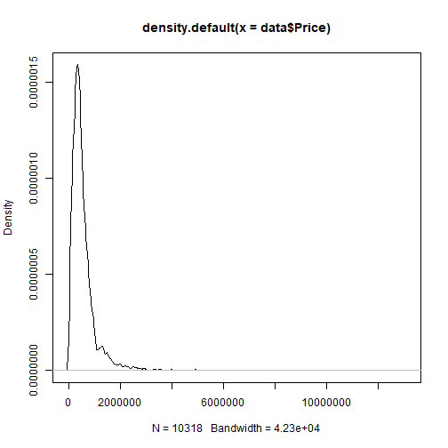


```r
#log trasnform our price var to get more normale distributed var.
d.log <- density(log(data$Price))
plot(d.log)
```

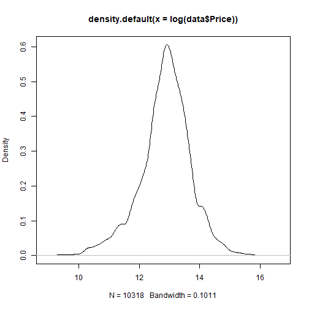


```r
# Some Variable are highly right skewed.
#Price, Living_space, lot, rooms and more. We will use the logtransformed datain our analysis.
d.density <- density(log(data$Living_space))
plot(d.density)
```

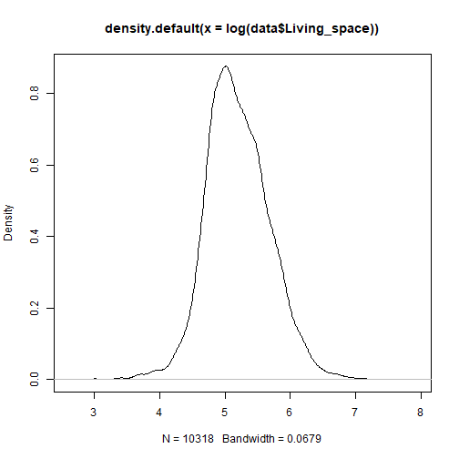

```r
hist(log(data$Rooms))
```

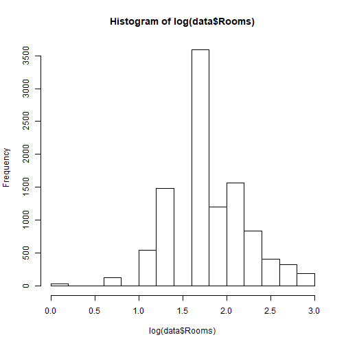

```r
# Some Variable are highly right skewed.
#Price, Living_space, lot, rooms and more. We will use the logtransformed datain our analysis.
d.density <- density(log(data$Living_space))
plot(d.density)
```


```r
hist(log(data$Rooms))
```


**WEEK 1**

**Linear Models**

Simple linear regression

Data Visualisation

Plot Price ~ Living_Space

```r
options(scipen=999) #block scientific notation

library(ggplot2)


#Living Space
ggplot(data, aes(log(Living_space), log(Price))) + geom_point() + geom_smooth(method = lm, se = F, color = 'red')
```

```
## `geom_smooth()` using formula 'y ~ x'
```

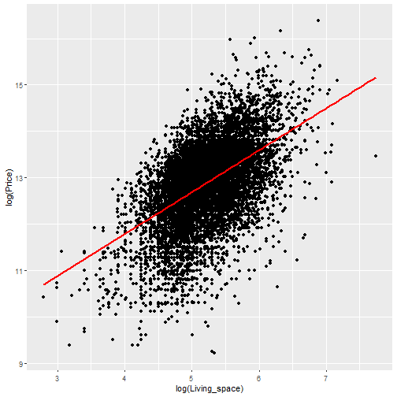

```r
#ggplot(data, aes(log(Living_space), log(Lot))) + geom_smooth(method = lm, se =F, color = 'red')
```

```r
lm.log.price_living <- lm(log(data$Price) ~ log(data$Living_space))
print(summary(lm.log.price_living))
```

```
## 
## Call:
## lm(formula = log(data$Price) ~ log(data$Living_space))
## 
## Residuals:
##     Min      1Q  Median      3Q     Max 
## -3.7836 -0.4079  0.0856  0.4683  2.7581 
## 
## Coefficients:
##                        Estimate Std. Error t value            Pr(>|t|)    
## (Intercept)             8.17522    0.07596  107.62 <0.0000000000000002 ***
## log(data$Living_space)  0.90280    0.01455   62.05 <0.0000000000000002 ***
## ---
## Signif. codes:  0 '***' 0.001 '**' 0.01 '*' 0.05 '.' 0.1 ' ' 1
## 
## Residual standard error: 0.7145 on 10316 degrees of freedom
## Multiple R-squared:  0.2718,	Adjusted R-squared:  0.2717 
## F-statistic:  3850 on 1 and 10316 DF,  p-value: < 0.00000000000000022
```

Data Visualisation

Plot Price ~ Rooms


```r
library(ggplot2)
#Rooms
ggplot(data, aes(log(Rooms), log(Price))) + geom_point()+ geom_smooth(method = lm, se = F, color= 'red')
```

```
## `geom_smooth()` using formula 'y ~ x'
```

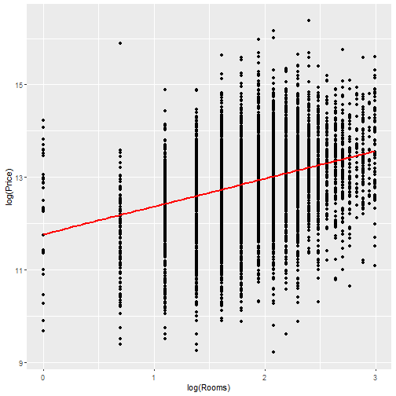

```r
ggplot(data, aes(log(Rooms), log(Price))) + geom_point(aes(size=Living_space, colour = factor(State)))
```

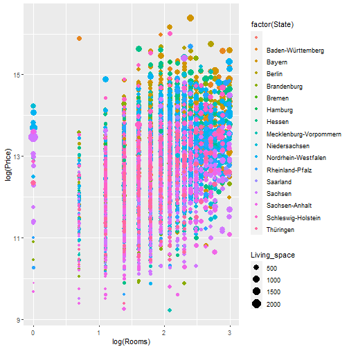

```r
ggplot(data, aes(log(Rooms), log(Price))) + geom_bin2d(bins = 30)
```

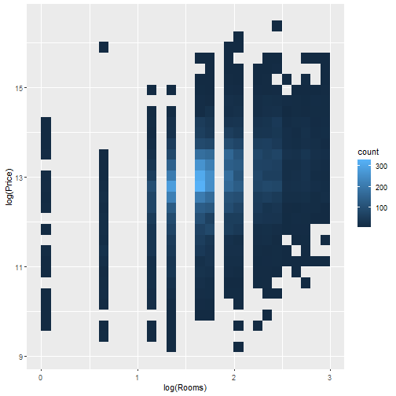

```r
lm.log.price_rooms <- lm(log(data$Price) ~ log(data$Rooms))
print(summary(lm.log.price_rooms))
```

```
## 
## Call:
## lm(formula = log(data$Price) ~ log(data$Rooms))
## 
## Residuals:
##     Min      1Q  Median      3Q     Max 
## -3.8055 -0.4340  0.0764  0.5004  3.7055 
## 
## Coefficients:
##                 Estimate Std. Error t value            Pr(>|t|)    
## (Intercept)     11.76680    0.03351   351.2 <0.0000000000000002 ***
## log(data$Rooms)  0.60064    0.01777    33.8 <0.0000000000000002 ***
## ---
## Signif. codes:  0 '***' 0.001 '**' 0.01 '*' 0.05 '.' 0.1 ' ' 1
## 
## Residual standard error: 0.7945 on 10316 degrees of freedom
## Multiple R-squared:  0.09968,	Adjusted R-squared:  0.0996 
## F-statistic:  1142 on 1 and 10316 DF,  p-value: < 0.00000000000000022
```


```r
#Living Space
ggplot(data, aes(log(Price), log(Lot))) + geom_point() + geom_smooth(method = lm, se = F, color = 'red')
```

```
## `geom_smooth()` using formula 'y ~ x'
```

```
## Warning: Removed 17 rows containing non-finite values (stat_smooth).
```

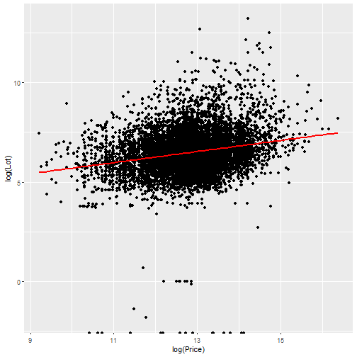

```r
#ggplot(data, aes(log(Living_space), log(Lot))) + geom_smooth(method = lm, se =F, color = 'red')
```


```r
#lm.log.Lot_Price <- lm(log(data$Lot) ~ log(data$Price))
#print(summary(lm.log.Lot_Price))
```


```r
# use ggplot instead - to do
#par(mfrow=c(2,1))
#boxplot(log(data$Price) ~ Type, main = 'Price ~ Type plotted with outliers')
#boxplot(log(data$Price) ~ Type, main = 'Price ~ Type plotted WITHOUT outliers', outline=FALSE)
```


```r
lm.type_rooms <- lm(Price ~ Type, data = data)
summary(lm.type_rooms)
```

```
## 
## Call:
## lm(formula = Price ~ Type, data = data)
## 
## Residuals:
##      Min       1Q   Median       3Q      Max 
## -1392012  -263738   -95738   125262 11487988 
## 
## Coefficients:
##                          Estimate Std. Error t value             Pr(>|t|)    
## (Intercept)                471775      26422  17.856 < 0.0000000000000002 ***
## TypeBungalow               375414      42748   8.782 < 0.0000000000000002 ***
## TypeCastle                 608025     233349   2.606             0.009183 ** 
## TypeCorner house            32516      45414   0.716             0.474011    
## TypeDuplex                  83429      28887   2.888             0.003884 ** 
## TypeFarmhouse             -113324      34176  -3.316             0.000917 ***
## TypeMid-terrace house       21962      27577   0.796             0.425814    
## TypeMultiple dwelling      -56185      37513  -1.498             0.134236    
## TypeResidential property   173526      38175   4.546           0.00000554 ***
## TypeSingle dwelling        -18688      30476  -0.613             0.539766    
## TypeSpecial property        -5322      38064  -0.140             0.888815    
## TypeVilla                 1040237      37366  27.839 < 0.0000000000000002 ***
## ---
## Signif. codes:  0 '***' 0.001 '**' 0.01 '*' 0.05 '.' 0.1 ' ' 1
## 
## Residual standard error: 518400 on 10306 degrees of freedom
## Multiple R-squared:  0.1367,	Adjusted R-squared:  0.1358 
## F-statistic: 148.4 on 11 and 10306 DF,  p-value: < 0.00000000000000022
```
**WEEK 2**

**model nonlinearity**

Polynomials
Graphical analysis

```r
gg.PriceRooms <- ggplot(data = data,
mapping = aes(y = log(Price),
x = Rooms)) +
geom_point()
gg.PriceRooms +
geom_smooth()
```

```
## `geom_smooth()` using method = 'gam' and formula 'y ~ s(x, bs = "cs")'
```

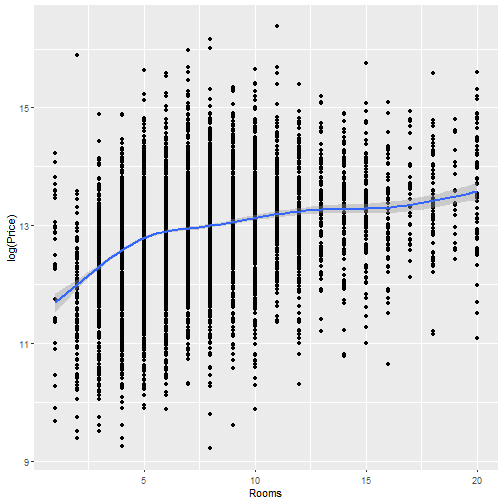

```r
gg.PriceRooms <- ggplot(data = data,
mapping = aes(y = log(Price),
x = log(Rooms))) +
geom_point()
gg.PriceRooms +
geom_smooth()
```

```
## `geom_smooth()` using method = 'gam' and formula 'y ~ s(x, bs = "cs")'
```

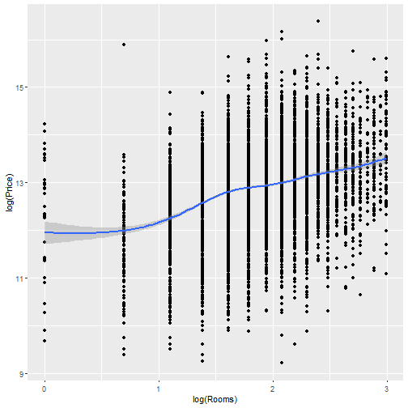


```r
gg.LotPrice <- ggplot(data = data,
mapping = aes(y = log(Lot),
x = log(Price))) +
geom_point()
gg.LotPrice +
geom_smooth()
```

```
## `geom_smooth()` using method = 'gam' and formula 'y ~ s(x, bs = "cs")'
```

```
## Warning: Removed 17 rows containing non-finite values (stat_smooth).
```

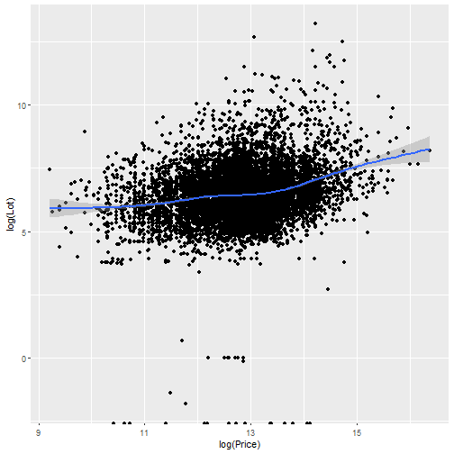

**WEEK 3**

**GLM**

Possion Model


